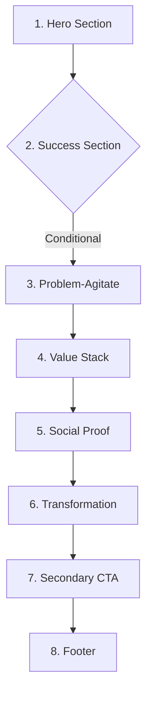

# Landing Page Architecture

This skill defines the high-converting Landing Page Architecture, detailing the required sections, their psychological jobs, layout systems, copywriting guidelines, and frontend implementations.

## Architectural Flow

High-converting landing pages must follow this precise structural flow. Each section has a specific psychological job to guide the visitor toward conversion.



---

### 1. HERO Section
- **Job**: Secure the user's primary conversion (e.g. email signup, reservation) or entice them to scroll.
- **Components**: `Eyebrow` → `Headline` → `Subheadline` → `CTA` → `Trust Signals`
- **Copy Guidelines**:
  - **Eyebrow**: 2-3 words of context, in a high-contrast accent color (e.g., Pitch Green).
  - **Headline**: The hook. Focus on the core value proposition or ultimate outcome. Keep it heavy and tightly tracked.
  - **Subheadline**: Expands on the headline. Explains the mechanism ("how it works") and removes friction.
  - **CTA**: High-contrast, interactive button (e.g., "Join the Waitlist").
  - **Trust Signals**: Bulleted risk-remover or proof point (e.g., "No credit card required", "Takes 10 seconds").
- **Tailwind Example Layout**:
  ```html
  <section class="relative flex flex-col items-center justify-center min-h-[85vh] px-4 text-center bg-zinc-950">
    <span class="px-3 py-1 text-xs font-semibold uppercase tracking-wider text-emerald-500 bg-emerald-500/10 rounded-full mb-6">
      Live Ticketing Reimagined
    </span>
    <h1 class="max-w-4xl text-5xl md:text-7xl font-extrabold tracking-tight text-white mb-6 leading-none">
      Get Real Tickets. <br/>
      <span class="text-transparent bg-clip-text bg-gradient-to-r from-emerald-400 to-teal-500">No Scalpers. No BS.</span>
    </h1>
    <p class="max-w-xl text-lg md:text-xl text-zinc-400 mb-8 font-medium">
      TicketTrade is the secure, fan-to-fan marketplace for live sports and concert tickets. Pure speed. Zero fees.
    </p>
    <div class="w-full max-w-md mb-4">
      <form class="flex flex-col sm:flex-row gap-2">
        <input type="email" placeholder="Enter your email address" class="flex-1 px-4 py-3 bg-zinc-900 border border-zinc-800 focus:border-emerald-500 focus:ring-1 focus:ring-emerald-500 text-white rounded-xl outline-none transition-all" required />
        <button type="submit" class="px-6 py-3 bg-emerald-500 hover:bg-emerald-600 active:scale-95 text-zinc-950 font-bold rounded-xl transition-all shadow-[0_0_20px_rgba(16,185,129,0.3)]">
          Join Waitlist
        </button>
      </form>
    </div>
    <div class="flex items-center gap-2 text-sm text-zinc-500">
      <svg class="w-4 h-4 text-emerald-500" fill="none" stroke="currentColor" viewBox="0 0 24 24"><path stroke-linecap="round" stroke-linejoin="round" stroke-width="2.5" d="M5 13l4 4L19 7"></path></svg>
      <span>Free to join • Instant validation</span>
    </div>
  </section>
  ```

---

### 2. SUCCESS Section (Conditional)
- **Job**: Eliminate immediate buyer's remorse and outline next steps. Shown dynamically after form submission.
- **Components**: `Checkmark` → `Confirmation` → `Deliverable list`
- **Copy Guidelines**:
  - **Checkmark**: Large green verified animation or vector icon.
  - **Confirmation**: Confirms status (e.g., "Registration Complete!").
  - **Deliverable List**: Bulleted list of what was unlocked or is arriving (e.g., "Your access token", "Waitlist number: #240").

---

### 3. PROBLEM–AGITATE Section
- **Job**: Make the current status quo painful and transition the user emotionally to the solution.
- **Components**: `3 Problems with Agitation` → `Personal Transition`
- **Copy Guidelines**:
  - **Problems**: Pinpoint three concrete struggles (e.g., exorbitant fees, fake tickets, slow checkouts).
  - **Agitation**: Build emotional resonance with the pain (e.g., "You spend hours in line just to get gouged by scalpers").
  - **Personal Transition**: Transition directly to the product's origin (e.g., "We got sick of the markup too. That's why we built...").

---

### 4. VALUE STACK Section
- **Job**: Make saying "no" feel mathematically and logically irrational.
- **Components**: `4 Tiers Descending` → `Total Value` → `Your Price`
- **Copy Guidelines**:
  - **Tiers**: Enumerate 4 high-value components of the offer (Core Access, Tools, Community, Exclusive Perks).
  - **Total Value**: Add up their realistic market values.
  - **Your Price**: Contrast this with the low actual price of the offer.

---

### 5. SOCIAL PROOF Section
- **Job**: Build credibility through real-world results from existing users.
- **Components**: `Header` → `3 Testimonials with Specific Results`
- **Copy Guidelines**:
  - **Header**: High-impact social proof headline (e.g., "Proven by Real Fans").
  - **Testimonials**: Exactly three testimonials, each highlighting a *quantifiable outcome* (e.g., saved $150, sold in under 2 minutes). Avoid generic "This is great!" testimonials.

---

### 6. TRANSFORMATION Section
- **Job**: Map a concrete journey of what life looks like after adoptiing the solution.
- **Components**: `4 Stages: Quick Win` → `Compound` → `Advantage` → `10x`
- **Copy Guidelines**:
  - **Quick Win**: Immediate result (e.g., account verified in under 10 seconds).
  - **Compound**: What happens in the first week (e.g., listing your first event).
  - **Advantage**: Mid-term outcome (e.g., finding under-market tickets automatically).
  - **10x**: The ultimate transformation (e.g., never worrying about missing a sold-out show again).

---

### 7. SECONDARY CTA Section
- **Job**: Convert visitors who have scrolled to the bottom but have not clicked yet.
- **Components**: `Avatar Stack` → `Question Headline` → `"Yes" Button`
- **Copy Guidelines**:
  - **Avatar Stack**: 3-5 overlapping customer profile photos showing that others have already joined.
  - **Question Headline**: Pose a direct choice (e.g., "Ready to secure your spot?").
  - **"Yes" Button**: A positive, conversion-focused action (e.g., "Yes, Let me in").

---

### 8. FOOTER Section
- **Job**: Establish professional legitimacy.
- **Components**: `Logo` → `Nav` → `Legal` → `Social`
- **Design Guidelines**:
  - Keep text muted and layouts simple to keep the user focused.
