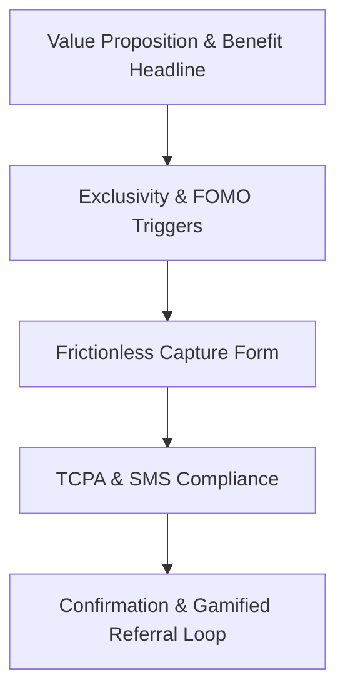

# Waitlist Page Designer

This skill provides comprehensive instructions, design systems, copywriting guidelines, compliance checklists, and component layouts for creating high-converting waitlist landing pages that effectively capture user emails and phone numbers.

## Core Conversion Principles

A waitlist page has one main job: **convert traffic into early signups**. Waitlist pages must prioritize simplicity, trust, and psychological motivation.



### 1. Headline & Value Proposition
- **Outcome-Driven**: Never use generic headlines like "Join our waitlist." Focus on the direct value/result.
  - *Bad*: "Sign up for TicketTrade waitlist."
  - *Good*: "Get Ticket Alerts 5 Seconds Before Scalpers Do."
- **Clear Mechanism**: The subheadline should explain *how* the product delivers that outcome and remove friction.

### 2. Exclusivity & FOMO (Fear of Missing Out)
- **Authentic Scarcity**: Clearly state that early spots are limited or rolled out in waves (e.g., "First wave: 500 invites").
- **Live Counter**: Showing a counter (e.g., "14,821 fans already registered") builds social proof and momentum.

### 3. Frictionless Capture Form
- **Limit Fields**: Keep fields to a minimum (ideally name, email, and phone number). Do not ask for company name, job title, or physical address.
- **Progressive Input**: If possible, request the email first, and then conditionally or progressively request the phone number for VIP notifications to reduce initial signup friction.

---

## SMS & TCPA Compliance (Non-Negotiable)

When collecting phone numbers for SMS marketing or launch alerts, you must conform to legal standards (such as the TCPA in the US). Failure to comply will lead to severe delivery penalties or legal issues.

### Required Compliance Guidelines
1. **Explicit Consent**: Consent to receive marketing texts must be separate and not combined with general terms. It cannot be pre-checked.
2. **Clear Disclosure**: Consent text must be located directly adjacent to the input field or CTA button.
3. **Opt-out Terms**: Explicitly specify how to opt-out (e.g., "Reply STOP to cancel").
4. **Rates Disclaimer**: State that message and data rates may apply.
5. **Frequency**: Mention that alerts are automated or recurring.

### Standard Compliance Copy (Use adjacent to input/button)
> *By providing your phone number, you consent to receive automated promotional and launch alerts via text from TicketTrade at the number provided. Consent is not a condition of purchase. Msg & data rates may apply. Reply STOP to opt out. View our [Privacy Policy](file:///#) and [Terms](file:///#).*

---

## The Referral & Gamification Loop

The best waitlist landing pages utilize viral loops to drive organic growth. Upon successful registration, transition the page to a "Success" state containing a referral link.

1. **Waitlist Rank**: Show their rank in line (e.g., "You are #1,402 in line").
2. **Viral Incentive**: Give them a clear way to skip ahead (e.g., "Share your link. For every friend who signs up, you move up 200 spots").
3. **Quick Share Actions**: Provide one-click buttons for copying the link, sharing on Twitter/X, WhatsApp, and SMS.

---

## TicketTrade Premium Dark Mode Templates

These components are designed according to **TicketTrade Brand Guidelines** (Deep Background `#09090b`, Surface/Card `#18181b`, Primary Text `#fafafa`, Pitch Green `#10b981`, and Stadium Blue `#3b82f6`).

### 1. Waitlist Sign-up Form (Email + SMS + TCPA Consent)

```html
<div class="w-full max-w-lg p-8 bg-zinc-900 border border-zinc-800 rounded-2xl shadow-xl">
  <h2 class="text-2xl font-bold tracking-tight text-white mb-2">Reserve Your Ticket Access</h2>
  <p class="text-zinc-400 mb-6 text-sm">Join the VIP waitlist to get immediate notification when tickets drop for your favorite events.</p>

  <form class="space-y-4">
    <!-- Email Field -->
    <div>
      <label for="email" class="block text-xs font-semibold uppercase tracking-wider text-zinc-500 mb-1.5">Email Address</label>
      <input type="email" id="email" name="email" required placeholder="name@domain.com"
        class="w-full px-4 py-3 bg-zinc-950 border border-zinc-800 text-white placeholder-zinc-600 rounded-xl outline-none focus:border-emerald-500 focus:ring-1 focus:ring-emerald-500 transition-all text-sm" />
    </div>

    <!-- Phone Field -->
    <div>
      <div class="flex justify-between items-center mb-1.5">
        <label for="phone" class="block text-xs font-semibold uppercase tracking-wider text-zinc-500">Phone Number (For Instant SMS Drops)</label>
        <span class="text-[10px] text-emerald-500 font-bold uppercase tracking-wider bg-emerald-500/10 px-1.5 py-0.5 rounded">Highly Recommended</span>
      </div>
      <input type="tel" id="phone" name="phone" placeholder="+1 (555) 000-0000"
        class="w-full px-4 py-3 bg-zinc-950 border border-zinc-800 text-white placeholder-zinc-600 rounded-xl outline-none focus:border-emerald-500 focus:ring-1 focus:ring-emerald-500 transition-all text-sm" />
    </div>

    <!-- Compliance Opt-in Checkbox -->
    <div class="flex items-start gap-3 mt-2">
      <input type="checkbox" id="sms-consent" name="sms-consent" required
        class="mt-1 w-4 h-4 bg-zinc-950 border border-zinc-800 rounded text-emerald-500 focus:ring-emerald-500 focus:ring-offset-zinc-900" />
      <label for="sms-consent" class="text-[11px] leading-relaxed text-zinc-500">
        I agree to receive automated notifications and text updates from TicketTrade at this phone number. Consent is not a condition of purchase. Msg & data rates may apply. Reply STOP to opt out.
      </label>
    </div>

    <!-- CTA Button -->
    <button type="submit"
      class="w-full py-3.5 mt-2 bg-emerald-500 hover:bg-emerald-600 active:scale-[0.98] text-zinc-950 font-bold rounded-xl transition-all shadow-[0_0_20px_rgba(16,185,129,0.2)] text-sm flex justify-center items-center gap-2">
      <span>Get Priority Access</span>
      <svg class="w-4 h-4" fill="none" stroke="currentColor" viewBox="0 0 24 24"><path stroke-linecap="round" stroke-linejoin="round" stroke-width="2" d="M14 5l7 7m0 0l-7 7m7-7H3"></path></svg>
    </button>
  </form>
</div>
```

### 2. Confirmation State (Referral & Viral Leaderboard)

```html
<div class="w-full max-w-lg p-8 bg-zinc-900 border border-zinc-800 rounded-2xl shadow-xl text-center">
  <!-- Checkmark -->
  <div class="inline-flex items-center justify-center w-16 h-16 bg-emerald-500/10 text-emerald-500 rounded-full mb-6">
    <svg class="w-8 h-8" fill="none" stroke="currentColor" viewBox="0 0 24 24"><path stroke-linecap="round" stroke-linejoin="round" stroke-width="2.5" d="M5 13l4 4L19 7"></path></svg>
  </div>

  <h2 class="text-2xl font-bold tracking-tight text-white mb-2">You're on the list!</h2>
  <p class="text-zinc-400 mb-6 text-sm">We've reserved your spot. Want to skip the queue?</p>

  <!-- Waitlist Position Tracker -->
  <div class="grid grid-cols-2 gap-4 p-4 bg-zinc-950 rounded-xl border border-zinc-800/50 mb-6">
    <div class="text-center">
      <span class="block text-[10px] uppercase tracking-wider text-zinc-500 mb-1">Your Rank</span>
      <span class="text-2xl font-extrabold text-white">#1,402</span>
    </div>
    <div class="text-center border-l border-zinc-800">
      <span class="block text-[10px] uppercase tracking-wider text-zinc-500 mb-1">People Ahead</span>
      <span class="text-2xl font-extrabold text-blue-500">1,401</span>
    </div>
  </div>

  <!-- Referral Link Share -->
  <div class="space-y-3">
    <label class="block text-xs font-semibold uppercase tracking-wider text-zinc-500 text-left">Your Referral Link</label>
    <div class="flex gap-2">
      <input type="text" readonly value="https://tickettrade.io/join?ref=user582"
        class="flex-1 px-3 py-2 bg-zinc-950 border border-zinc-800 text-zinc-300 rounded-lg text-xs outline-none select-all" />
      <button class="px-4 py-2 bg-zinc-800 hover:bg-zinc-700 text-white rounded-lg text-xs font-semibold transition-all">
        Copy
      </button>
    </div>

    <!-- Social Share Buttons -->
    <div class="grid grid-cols-3 gap-2 mt-4">
      <a href="#" class="flex items-center justify-center gap-1.5 py-2 bg-[#1DA1F2]/10 hover:bg-[#1DA1F2]/20 text-[#1DA1F2] rounded-lg text-xs font-semibold transition-all">
        <span>Share on X</span>
      </a>
      <a href="#" class="flex items-center justify-center gap-1.5 py-2 bg-[#25D366]/10 hover:bg-[#25D366]/20 text-[#25D366] rounded-lg text-xs font-semibold transition-all">
        <span>WhatsApp</span>
      </a>
      <a href="#" class="flex items-center justify-center gap-1.5 py-2 bg-zinc-800 hover:bg-zinc-700 text-white rounded-lg text-xs font-semibold transition-all">
        <span>Email Link</span>
      </a>
    </div>
  </div>
</div>
```
